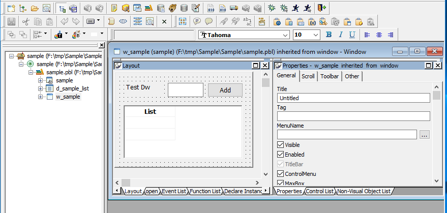
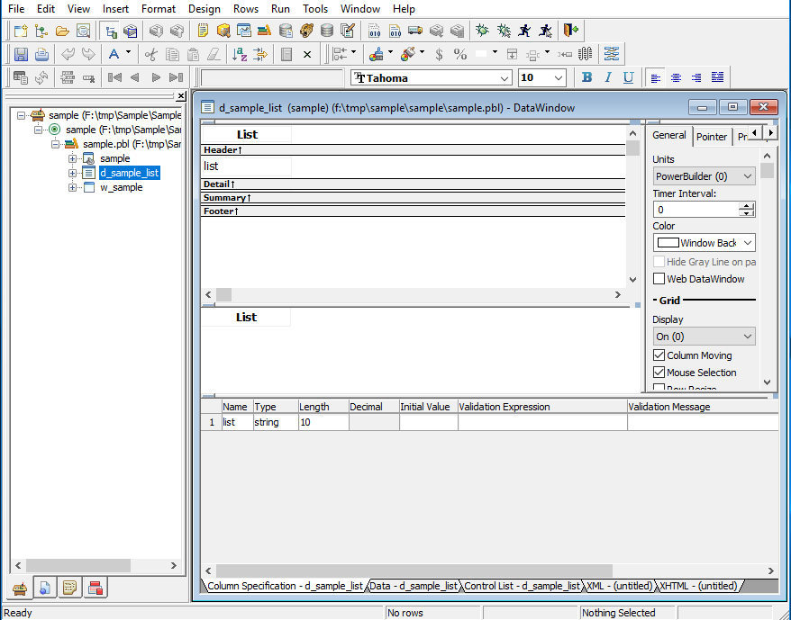
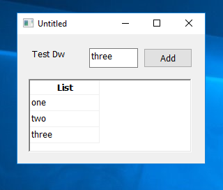

# PBJavaHelloWorld

Sample HelloWorld Application source code in PowerBuilder

This application is a very simple Powerbuilder App used as a sample for [Mobilize.NET](https://www.mobilize.net) [PBMAP for Java Tool](https://www.mobilize.net/powerbuilder)

This example is used to illustrate making changes on WebMAP Applications.

# About this app

This application is made up of two elements:

A window called **w_sample**

[CODE](./Export/sample.sra)

A datawindow called **d_sample_list**

[CODE](./Export/d_sample_list.srd)

And an application called **sample**
[CODE](./Export/sample.sra)

Once it is running it looks like:

